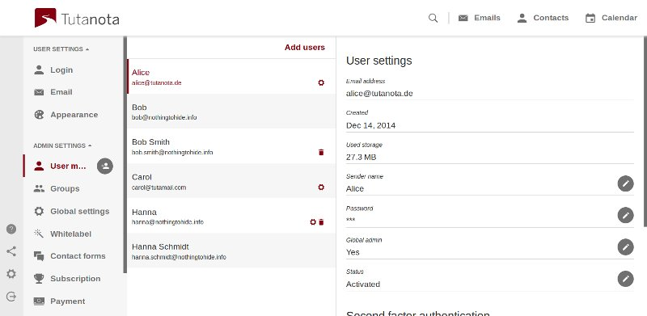

<!--
N.B.: This README was automatically generated by https://github.com/YunoHost/apps/tree/master/tools/README-generator
It shall NOT be edited by hand.
-->

# Tutanota for YunoHost

[](https://dash.yunohost.org/appci/app/tutanota)    
[](https://install-app.yunohost.org/?app=tutanota)

*[Lire ce readme en français.](./README_fr.md)*

> *This package allows you to install Tutanota quickly and simply on a YunoHost server.
If you don't have YunoHost, please consult [the guide](https://yunohost.org/#/install) to learn how to install it.*

## Overview

Tutanota is the secure email service with built-in end-to-end encryption that enables you to communicate securely with anyone on all your devices.


**Shipped version:** 3.95.1~ynh1

**Demo:** https://demo.example.com

## Screenshots



## Disclaimers / important information

To access admin panel, use URL of the following kind: http://product_installation_URL/?admin

For example: http://webmail.domain.com/?admin

Default login is "admin", password is the one you choose during install. 

## Documentation and resources

* Official app website: https://github.com/tutao/tutanota
* Official user documentation: https://yunohost.org/apps
* Official admin documentation: https://yunohost.org/packaging_apps
* Upstream app code repository: https://github.com/tutao/tutanota
* YunoHost documentation for this app: https://yunohost.org/app_tutanota
* Report a bug: https://github.com/YunoHost-Apps/tutanota_ynh/issues

## Developer info

Please send your pull request to the [testing branch](https://github.com/YunoHost-Apps/tutanota_ynh/tree/testing).

To try the testing branch, please proceed like that.
```
sudo yunohost app install https://github.com/YunoHost-Apps/tutanota_ynh/tree/testing --debug
or
sudo yunohost app upgrade tutanota -u https://github.com/YunoHost-Apps/tutanota_ynh/tree/testing --debug
```

**More info regarding app packaging:** https://yunohost.org/packaging_apps